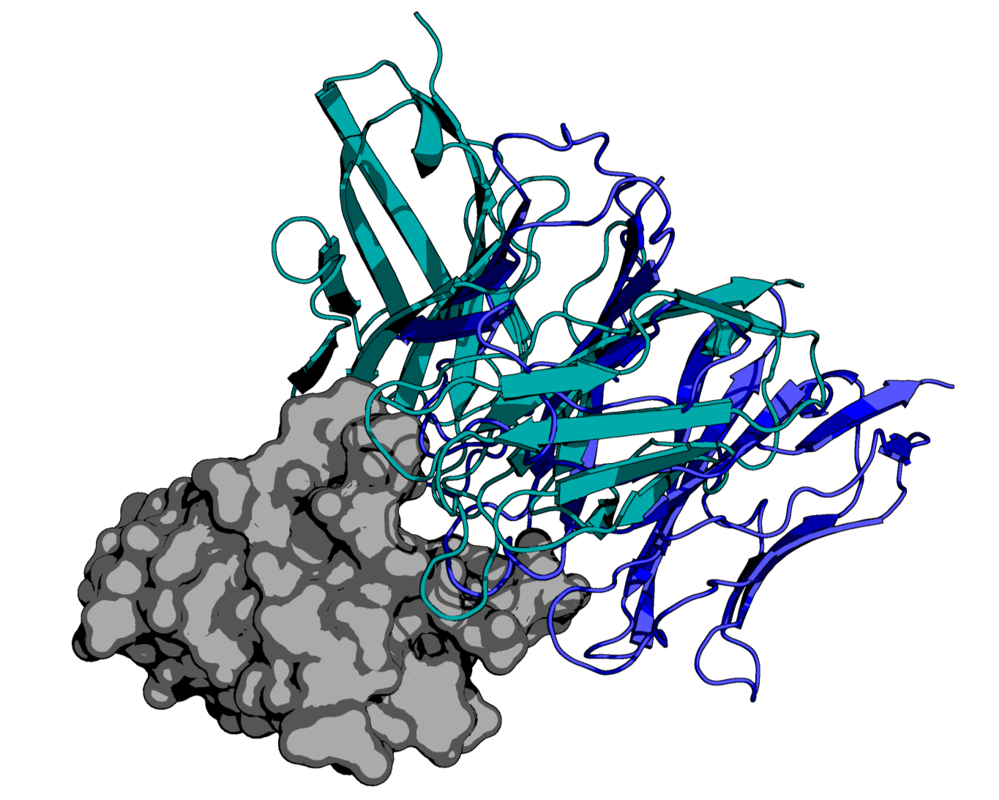

# PD-1 Targeted Antibody Discovery Using AI Protein Diffusion

## Diffusion of Novel, PD1-targeting Fab Structures with _in silico_ Evaluation

<h3 align="right">Tuple, LLC</h3>

<!---->

## Antibody Generation and Testing

### Steps:
0. Generate Sequences using EvoDiff
    - Follow EvoDiff logic in [`scripts/0_sequence_generation/EvoDiff_sequence_generation.md`](scripts/0_sequence_generation/EvoDiff_sequence_generation.md)
1. Generate Structures using AlphaFold2 (TUPPD1-001 to TUPPD1-009)
    - Run AlphaFold2 Batch using [`scripts/1_structure_generation/AlphaFold2_batch.ipynb`](scripts/1_structure_generation/AlphaFold2_batch.ipynb)
2. Prepare Structures
    - Renumber L chains in PDB files with PyMol: [`scripts/2_structure_prep/PDB_renumberer.ipynb`](scripts/2_structure_prep/PDB_renumberer.ipynb)
    - Detect CDR loop residues: `scripts/2_structure_prep/fab_cdr_detection.ipynb`
3. Generate HADDOCK experiment files
    - Run experiment generation using [`scripts/3_experiment_generation/make_HADDOCK_experiments.ipynb`](scripts/3_experiment_generation/make_HADDOCK_experiments.ipynb)
4. Submit HADDOCK experiments to HPC
    - Create Singularity container from Docker image: `singularity build haddock.sif docker://cford38/haddock:2.4_36cores`
    - Run experiment generation: `bash ./scripts/4_experiment_submission/submit_experiments.sh`
        - (Remember to `chmod -R 755` the `experiments/` folder so that Singularity can execute the scripts.)
5. Collect best docked PDB structure and metrics for each experiment
    - Run experiment metrics collection: [`scripts/5_metrics_collection/postprocessing.ipynb`](scripts/5_metrics_collection/postprocessing.ipynb)
        - This notebook also runs PRODIGY to calculate binding affinities for each structure.
6. Clean up HADDOCK run files
    - Run cleanup to move each experiments' run1/ directory into outputs: [`scripts/6_cleanup/cleanup.ipynb`](scripts/6_cleanup/cleanup.ipynb)
X. Run various post-analyses:
    - abYsis for analyzing the residues in the Fabs: [`analysis/abysis`](analysis/abysis)
    - OpenMM for molecular dynamics of the docked structures: [`analysis/molecular_dynamics/run_openmm.ipynb`](analysis/molecular_dynamics/run_openmm.ipynb)
